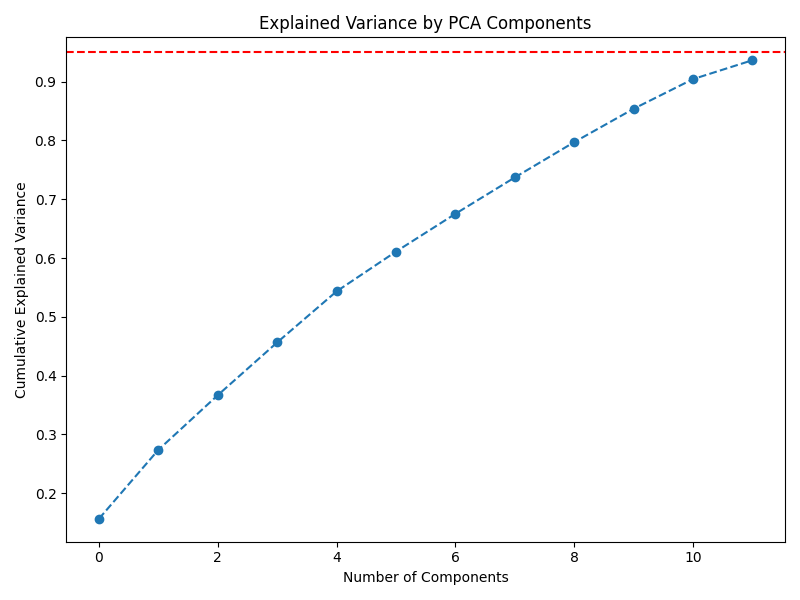
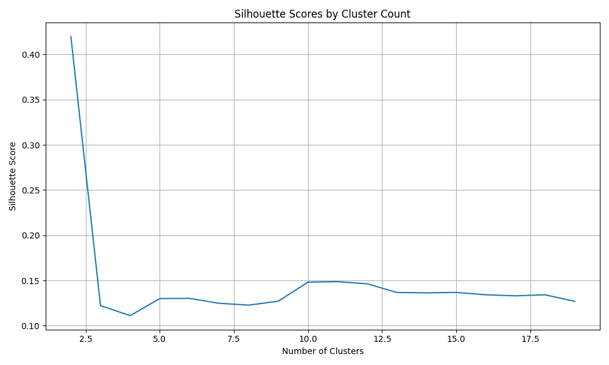
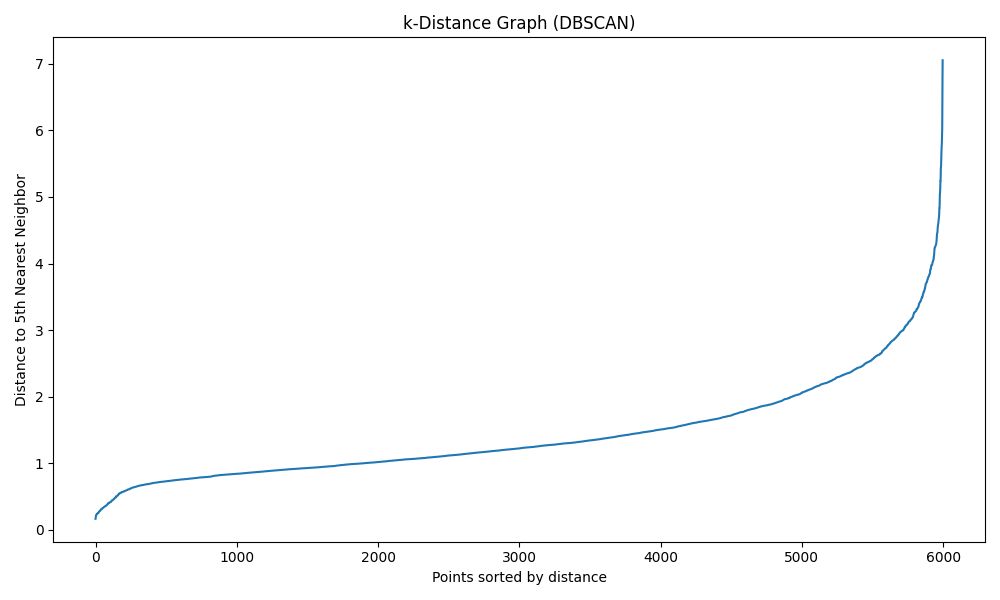
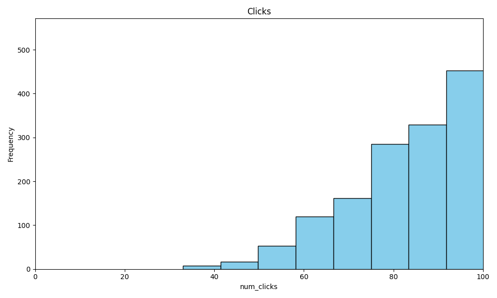

# 📊 TravelTide Final Project – Customer Segmentation & Insights

This project applies advanced data analysis and clustering techniques to segment TravelTide users based on their booking and travel behavior. 
By combining SQL data extraction, Python preprocessing, and Tableau visualizations, it provides actionable insights and personalized perk strategies to enhance customer engagement and maximize business value.

## Table of Contents
- [Project Overview](#🚀-project-overview)
- [Project Structure](#🧩-project-structure)
- [Features & Steps](#⚙️-features--steps)
- [Business Insights](#📈-business-insights-examples)
- [Perk Strategy](#🎁-perk-strategy-by-user-segment)
- [Assumptions & Risks](#🔍-assumptions--risks-by-cluster)
- [Output Files](#🗃️-output-files)
- [Interactive Dashboard](#📊-interactive-tableau-dashboard)
- [Key Learnings](#🧠-key-learnings)

---

## 🚀 Project Overview

- **Objective**: Segment TravelTide users into meaningful groups to personalize perks and understand customer types.
- **Tech Stack**: Python, PostgreSQL, SQLAlchemy, Pandas, Scikit-learn, Seaborn, Matplotlib

---

## 🧩 Project Structure

```
TravelTide_FinalProject_Ehud/
├── TravelTide Final-Project Ehud.py        # ✔ Main analysis pipeline
├── TravelTide Final-Project Summary Ehud.pdf  # ✔ Executive PDF summary
├── TravelTide Final-Project Presentation Ehud  # ✔ Slide deck (Tableau or PowerPoint)
├── README.md                                # ✔ Project overview and instructions
├── requirements.txt                         # ✔ Python environment file
├── clusters/                                # ✔ CSVs per KMeans cluster
├── perks/                                   # ✔ CSVs per perk type
├── plots/
│   ├── eda/
│   ├── pca/
│   ├── clustering/
│   └── dbscan/
├── cleaned_sessions.csv                     # ✔ Cleaned data
├── pca_sessions.csv                         # ✔ PCA projection
├── final_with_segments_and_score.csv        # ✔ Final enriched dataset
└── docs/
    ├── schema.dot
    └── schema.png                           # ✔ Optional schema if generated

```

---

## ⚙️ Setup Instructions

1. Clone the repo or download the files.
2. Install dependencies:

```bash
pip install pandas sqlalchemy matplotlib seaborn scikit-learn psycopg2-binary
```

3. Make sure you update your DB connection string and SQL file path if needed.
4. Run the main script:

```bash
python "TravelTide Final-Project Ehud.py"
```

---

## 📌 Features & Steps

1. **SQL Query**:
   - Filters active users
   - Joins sessions with flights, hotels, and users
   - Adds derived features like distance flown, hotel costs, etc.

2. **Data Cleaning**:
   - Imputes missing values
   - Drops irrelevant columns

3. **Feature Engineering**:
   - Computes average nights per trip
   - Calculates customer age
   - Encodes categorical variables

4. **Dimensionality Reduction**:
   - PCA to reduce noise and improve clustering

5. **Clustering**:
   - KMeans (9 clusters chosen via silhouette score)
   - DBSCAN for outlier analysis
   - **KMeans was selected after testing different cluster counts using the silhouette score. 
     DBSCAN was explored for outlier detection but didn’t separate meaningful customer segments as well as KMeans.**

6. **Segmentation Logic**:
   - Assigns customer **booking segments** (e.g., Frequent Flyer, Family Traveler, First Timer)
   - Calculates a **value score** (weighted by spending, trips, sessions)

7. **Exported Outputs**:
   - Cleaned and enriched user dataset
   - Cluster-specific CSVs
   - Perk-specific CSVs
   - Final file with all labels and scores

---

## 📈 Business Insights (Examples)

- **Luxury Loyalists** represent a high-value segment willing to pay for comfort and upgrades, indicating targeted premium perks will likely increase loyalty.
- **Young Adventurers** show lower spend and engagement but can be converted early with introductory perks like welcome drinks and first-time discounts.
- **Family Vacationers** respond well to family-friendly perks such as kids stay free and airport transfers, aligning with their travel behavior.
- **Weekend Explorers** prefer convenience-based perks such as early check-in and free breakfast, reflecting their short-trip patterns.
- **Budget Travelers** are highly price-sensitive, making discount-focused perks crucial to retaining this segment.
- **Spontaneous Bookers** benefit from flexible perks like late check-out and last-minute promotions due to their impulsive booking behavior.
- **Frequent Flyers** value speed and convenience perks, such as priority check-in, which reinforce loyalty.
- **Solo Jetsetters** appreciate perks that simplify travel logistics, including free luggage handling and lounge access.
- **Last-Minute Planners** require fast, frictionless perks like instant booking bonuses and timely reminders to convert last-minute trips.

These insights help prioritize perk allocation and marketing efforts to maximize ROI and customer satisfaction.


---

## 🎁 Perk Strategy by User Segment

Based on the clustering results, we assigned perks to each user group to improve booking conversion and user satisfaction.
Below is the final mapping of clusters to their suggested perks and backup offers.

| Cluster # | Name                 | Main Perk (A)         | Backup Perk (B)            | Justification                                                                |
| --------- | -------------------- | --------------------- | -------------------------- | ---------------------------------------------------------------------------- |
| 0         | Luxury Loyalists     | Free Room Upgrade     | Loyalty Points             | Older users with high spend and high conversion. Appreciate comfort & value. |
| 1         | Young Adventurers    | Welcome Drink         | First-Time Discount        | Young, low-spend, low conversion. Hook them early with perks and experience. |
| 2         | Family Vacationers   | Kids Stay Free        | Airport Transfer           | Mid-age, high hotel spend. Likely traveling with family.                     |
| 3         | Weekend Explorers    | Early Check-in        | Free Breakfast             | Quick trips, low duration. Convenience matters.                              |
| 4         | Budget Travelers     | 10% Discount          | Price Freeze Offer         | Low spenders. Responsive to savings-focused perks.                           |
| 5         | Spontaneous Bookers  | Late Checkout         | Promo on Last-Minute Deals | High sessions, lower booking rate — flexibility perk helps.                  |
| 6         | Frequent Flyers      | Priority Check-in     | Upgrade on 3rd Booking     | High trip count, solid conversion. Reward loyalty behavior.                  |
| 7         | Solo Jetsetters      | Free Luggage Handling | Lounge Access Voucher      | Low average spend but consistent solo bookings. Simplify the journey.        |
| 8         | Last-Minute Planners | Instant Booking Bonus | SMS Reminders              | Short notice planners. Instant offers improve conversion.                    |

Each cluster was defined based on PCA + KMeans results using user session data and travel behavior patterns.

## 🔍 Cluster Insights (Detailed View)

- **Cluster 0 – Luxury Loyalists**  
  Older users with high hotel spend and top value scores. Comfort + recognition works.  
  → *Free Room Upgrade / Loyalty Points*

- **Cluster 1 – Young Adventurers**  
  Youngest users with low spend and engagement. First-time discounts and light perks convert best.  
  → *Welcome Drink / First-Time Discount*

- **Cluster 2 – Family Vacationers**  
  Mid-aged, high spenders often with children and extra bags. Travel in family packs.  
  → *Kids Stay Free / Airport Transfer*

- **Cluster 3 – Weekend Explorers**  
  Few nights per trip and lower trip counts. Quick, convenient escapes.  
  → *Early Check-in / Free Breakfast*

- **Cluster 4 – Budget Travelers**  
  Lower spend and average trip frequency. Price-driven segment.  
  → *10% Discount / Price Freeze Offer*

- **Cluster 5 – Spontaneous Bookers**  
  High sessions, but fewer bookings — impulsive browsers.  
  → *Late Checkout / Last-Minute Deal Promo*

- **Cluster 6 – Frequent Flyers**  
  Most bookings and high loyalty potential. They travel often and need smooth journeys.  
  → *Priority Check-in / Upgrade on 3rd Booking*

- **Cluster 7 – Solo Jetsetters**  
  Travel solo, light on bags, moderate spenders. Value convenience and simplicity.  
  → *Free Luggage Handling / Lounge Access Voucher*

- **Cluster 8 – Last-Minute Planners**  
  Short-notice trips, short durations, but good spenders. Need quick, low-friction perks.  
  → *Instant Booking Bonus / SMS Reminders*

KMeans was selected after testing different cluster counts using the silhouette score. 
DBSCAN was explored for outlier detection but didn’t separate meaningful customer segments as well as KMeans.

# 🔍 Assumptions & Risks by Cluster

Cluster 0 – Luxury Loyalists
Assumptions: Older users value comfort and recognition.
Risks: Small sample size may overrepresent high spenders. Assumes loyalty based on spend alone.

Cluster 1 – Young Adventurers
Assumptions: Younger users are early in their travel journey and price-sensitive.
Risks: Low spend might be temporary. Perk impact is uncertain due to low engagement levels.

Cluster 2 – Family Vacationers
Assumptions: High hotel spend and many bags signal family travel.
Risks: Some solo travelers may carry multiple bags; family status inferred, not explicit.

Cluster 3 – Weekend Explorers
Assumptions: Low trip duration = short escapes, prefer efficiency.
Risks: Low volume may lead to underfitting. Perk effectiveness may vary with trip purpose.

Cluster 4 – Budget Travelers
Assumptions: Cost-focused users react well to discounts.
Risks: Over-reliance on price perks may reduce margin. True loyalty is unclear.

Cluster 5 – Spontaneous Bookers
Assumptions: High sessions, low bookings implies indecision or impulsive behavior.
Risks: Users may be bots or comparison shoppers. Behavior may change over time.

Cluster 6 – Frequent Flyers
Assumptions: Loyal, consistent travelers need speed and ease.
Risks: May already receive loyalty perks elsewhere. Needs segmentation by loyalty program overlap.

Cluster 7 – Solo Jetsetters
Assumptions: Frequent solo trips suggest independence and need for simplicity.
Risks: Spend is modest — may not respond to perks. Solo status is inferred.

Cluster 8 – Last-Minute Planners
Assumptions: Quick booking-to-travel window = urgency.
Risks: Segment may include business travelers or emergencies — hard to personalize reliably.


---

## ✍️ Author

- Project by **Ehud** (Data Analyst @ TravelTide Academy Project)

---

## 📬 Feedback / Improvements

Feel free to fork the project, open issues, or suggest enhancements!

### 📊 PCA Explained Variance



### 📊 Silhouette Scores by Cluster Count



### 📊 DBSCAN k-Distance Plot



### 📊 Histogram of Clicks




## 🗃️ Output Files

| File Name                             | Description                               |
|--------------------------------------|-------------------------------------------|
| `cleaned_sessions.csv`               | Cleaned user session data before clustering |
| `pca_sessions.csv`                   | PCA-reduced version of session data         |
| `final_with_segments_and_score.csv`  | Final data with clusters, segments, scores |
| `cluster_summary.csv`                | Cluster-level KPIs for Tableau/slides       |
| `clusters/cluster_*.csv`             | Per-cluster user files for analysis         |
| `perks/perk_*.csv`                   | Per-perk assigned user lists                |


## 📊 Interactive Tableau Dashboard

Explore the full interactive dashboard for the TravelTide segmentation project on Tableau Public:

<a href="https://public.tableau.com/app/profile/ehud.hermon/viz/TravelTideFinalDashboard/Dashboard3PerksValidation" target="_blank">View the TravelTide Dashboard on Tableau Public</a>


## 🧠 Key Learnings

- Learned to integrate SQL with Python for pipeline automation
- Applied PCA to improve clustering interpretability
- Explored multiple clustering methods and validated using silhouette score and DBSCAN
- Practiced translating data science output into business insights and perk strategies
